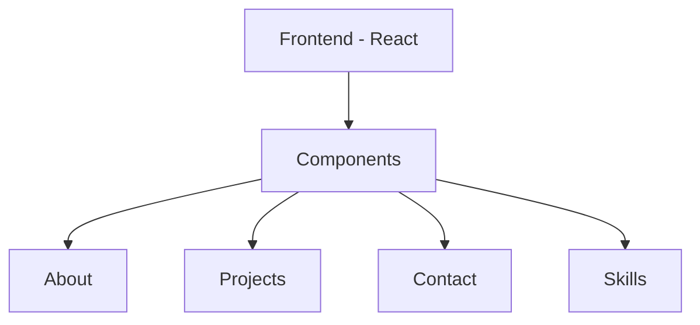

# Portfolio Website

A modern and responsive portfolio website built using the MERN stack (MongoDB, Express.js, React.js, Node.js) with additional features and technologies.

## Project Overview

This portfolio website showcases personal projects, skills, and professional information with a modern and interactive user interface.

### Key Features
- Responsive design
- Interactive UI components
- Project showcases
- Contact form
- Skills section
- Dynamic content management

